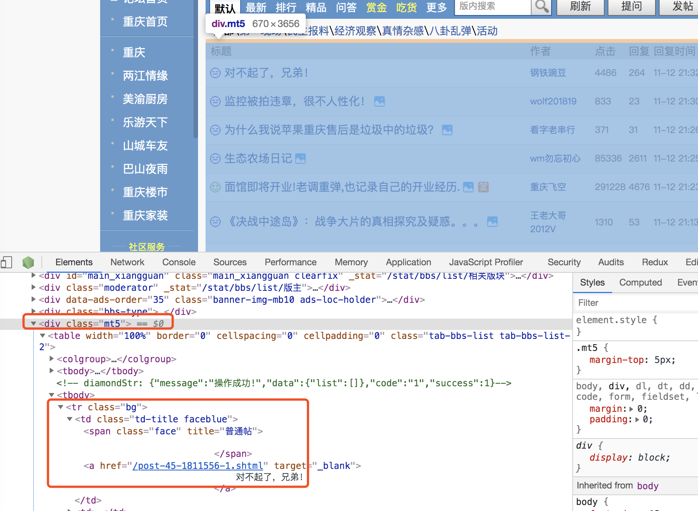
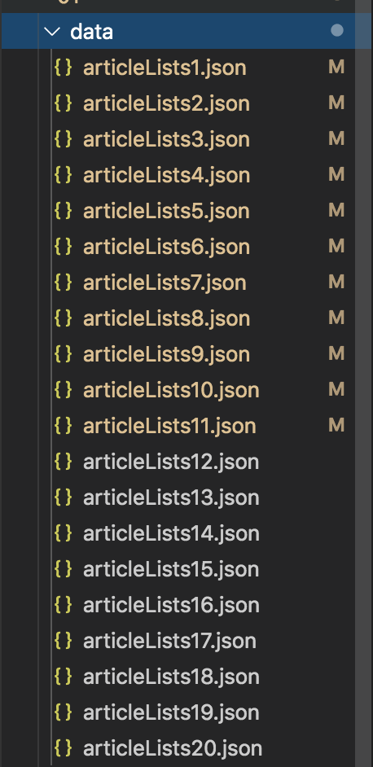
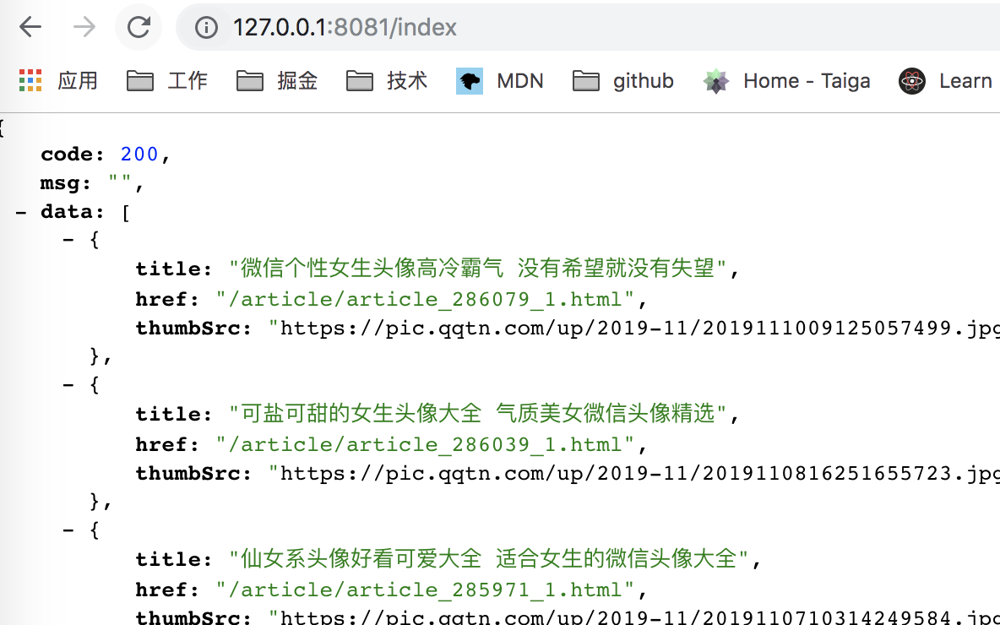
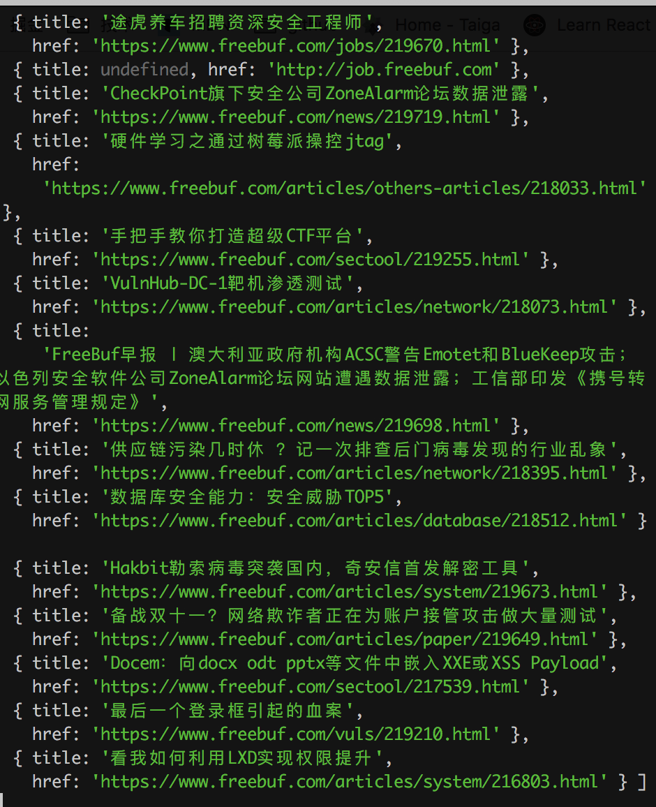

<!--
 * @Author: your name
 * @Date: 2019-11-22 17:31:58
 * @LastEditTime: 2019-11-22 21:58:44
 * @LastEditors: Please set LastEditors
 * @Description: In User Settings Edit
 * @FilePath: /node_crawler/README.md
 -->
## 基于node,express,koa的爬虫
## 01:node爬取 http://bbs.tianya.cn/list-45-1.shtml 数据
### 安装
+ npm install

### 运行
+ node server.js

### 介绍
+ 分析页面dom结构

  - 看出每个标题都是在class为mt5下的tr下面
+ 所以遍历.mt5下的tr
  
+ 把数据全部放到data文件夹下面

## 02:express爬取 https://www.qqtn.com/ 图片
### 安装
+ npm install

### 运行
+ node demo.js

### 访问 127.0.0.1:8081

### 访问 127.0.0.1:8081/index

### 介绍
+ 同01分析

## 03：koa爬取https://www.freebuf.com/ 数据
### 安装
+ npm install

### 运行
+ node index.js

### 访问127.0.0.1:1234/index

